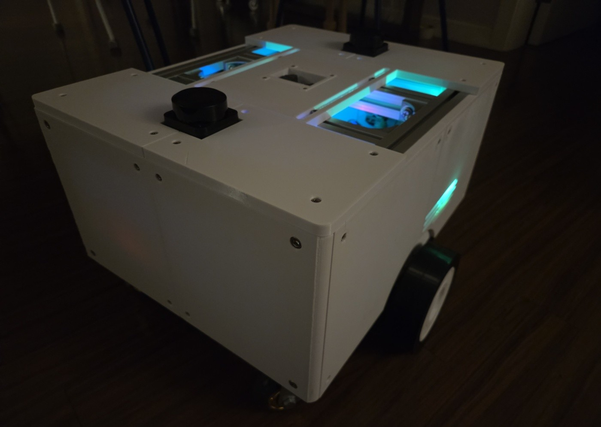

# CUBIC

> **로봇 개발에서 반복되는 이동 플랫폼 설계를 줄이기 위한 ROS 2 기반 모듈형 연구·개발용 모바일 로봇 플랫폼**

CUBIC C1은 새로운 로봇 프로젝트를 시작할 때마다 차체, 구동부, 전원부, 하위 제어기, 센서 및 ROS 2 환경을 처음부터 구축해야 하는 문제를 줄이기 위해 개발한 **범용 모바일 로봇 플랫폼**이다.

특정 목적을 수행하는 완성형 로봇이 아니라, 사용자가 필요한 센서·컴퓨팅 장치·상부 모듈과 알고리즘을 추가하여 새로운 로봇 시스템을 빠르게 구성할 수 있는 **재사용 가능한 연구 기반**을 목표로 한다.

---

## 🔗 바로가기

| 바로가기                                                             | 내용                                    |
| ---------------------------------------------------------------- | ------------------------------------- |
| **[프로젝트 개요](./docs/01_Project%20Overview/)**                     | 개발 배경 · 목표 · 시스템 구성 · 역할 및 일정         |
| **[기구 설계](./docs/02_Architecture/01_Mechanical%20Integration/)** | 프레임 · 모듈 장착 · 기구 통합                   |
| **[전기 설계](./docs/02_Architecture/02_Electrical/)**               | 전원 · 제어기 · 센서 · 결선                    |
| **[소프트웨어 구조](./docs/02_Architecture/03_Software/)**              | ROS 2 · 하위 제어 · 통신 구조                 |
| **[ROS 2 Workspace](./cubic_ws/)**                               | Bring-up · SLAM · Localization · Nav2 |
| **[MCU Firmware](./firmware/)**                                  | Motor Controller · Power Controller   |
| **[System Services](./systemd/)**                                | 부팅 및 ROS 2 systemd 서비스                |
| **[Troubleshooting](./docs/04_Test/)**                           | 문제 분석 · 원인 · 해결 과정                    |
| **[하드웨어 목록](./docs/03_Datasheet/)**                              | 주요 부품 및 하드웨어 구성                       |
| **[3D Model](./docs/06_3Dmodel/)**                               | 전체 조립 및 개별 STEP 모델                    |

> ROS 2 패키지, MCU Firmware 및 systemd 서비스의 세부 파일 구성과 사용 방법은 각 디렉터리의 README에서 확인할 수 있다.

---

## 📌 Project Overview

로봇 프로젝트에서는 핵심 기능을 개발하기 전에 **이동 플랫폼 자체를 구축하는 데 많은 시간과 비용이 소모된다.**

직접 제작할 경우 프레임, 모터, 배터리, 전원 회로, 제어기, 배선, 센서 장착 구조와 ROS 2 환경까지 반복적으로 구축해야 한다. 반대로 상용 모바일 플랫폼은 높은 비용이나 제한적인 기구·전기적 확장성 때문에 새로운 장치와 목적에 맞게 수정하기 어려운 경우가 있다.

CUBIC은 이러한 문제에서 출발하였다.

> **이동과 기본 자율주행에 필요한 기반 시스템을 미리 구축하고, 새로운 프로젝트에서는 그 위에 필요한 기능만 개발한다.**

이를 위해 CUBIC C1에는 다음 요소를 하나의 플랫폼으로 통합하였다.

* 알루미늄 프로파일 기반 모듈형 프레임
* 24 V Differential Drive 구동계
* 독립적인 Motor / Power Controller
* Raspberry Pi 기반 ROS 2 상위 제어 환경
* Dual LiDAR 기반 360° 환경 인식
* IMU · Wheel Odometry · EKF 기반 상태 추정
* SLAM · Localization · Navigation
* Emergency Stop · Watchdog 기반 안전 구조
* 외부 모듈용 Ethernet / Power Interface

상세 설계와 개발 과정은 상단 바로가기 또는 [`docs/`](./docs/) 디렉터리를 참고한다.

---

## 📄 License

본 프로젝트의 사용 및 배포 조건은 [`LICENSE`](./LICENSE)를 참고한다.
