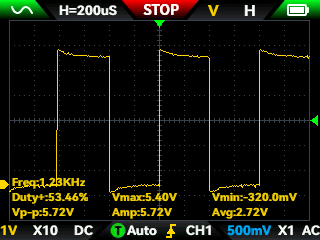
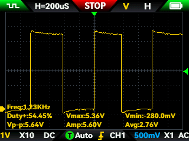
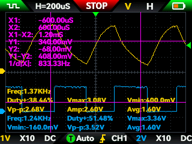
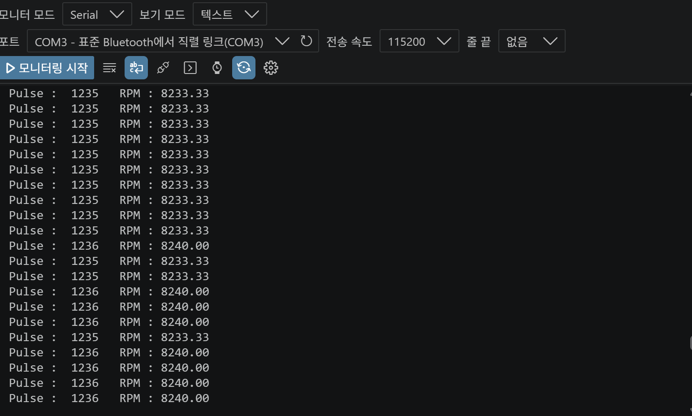
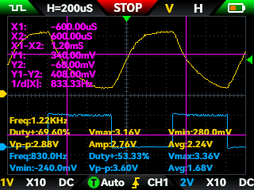
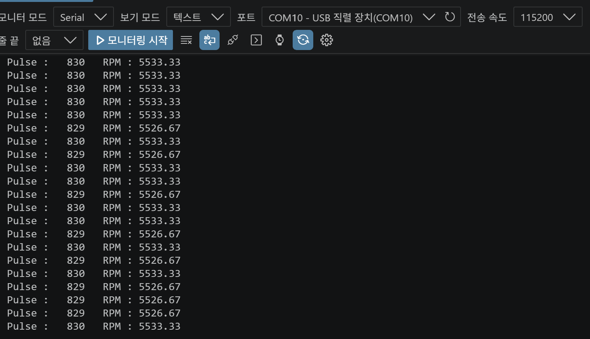

# Motor FG Signal Analysis & Detection Algorithm Validation

CUBIC C1의 구동 모터는 제조사 자료에서 FG 출력 방식, PPR, PWM 입력 특성 등의 정보가 충분히 제공되지 않았다.

이에 따라 실제 모터의 전기적 특성을 직접 측정하여 인터페이스를 결정하였으며,
이후 광절연 회로 적용 과정에서 발생한 FG 파형 왜곡 문제를 분석하고
ADC 기반 Hysteresis 검출 알고리즘을 적용하여 속도 피드백 신호를 복원하였다.

본 문서는 다음 두 단계의 검증 과정을 기록한다.

1. 모터 FG 및 PWM 인터페이스 역설계
2. PC817 절연 이후 FG 검출 알고리즘 검증

---

# 1. 사용 장비

| 장비 | 모델 / 사양 |
|---|---|
| BLDC Motor | XD42XA-4260WSY, 24 V / 82 W / 300 RPM |
| Oscilloscope | FNIRSI 2C53T |
| Digital Multimeter | FNIRSI 2C53T 내장 DMM |
| Function Generator | FNIRSI 2C53T 내장 Function Generator |
| Power Supply | 24 V DC Power Supply |
| Motor Controller MCU | Raspberry Pi Pico 2 / RP2350 |

---

# 2. Motor Interface Reverse Engineering

## 2.1 FG 출력 초기 측정

FG와 GND 사이의 전압을 멀티미터로 측정한 결과 약 **2.4 V**가 측정되었다.

초기에는 2.5 V Logic 또는 Open Collector 출력 가능성을 고려하였으나,
FG가 주기적으로 변화하는 디지털 펄스라면 멀티미터에서는 시간 평균 전압이 표시될 수 있으므로
출력 형태를 확정하기 위해 오실로스코프 측정을 추가로 수행하였다.

---

## 2.2 FG 원신호 측정

저항을 연결하지 않은 상태에서 FG 출력 파형을 측정하였다.

| 항목 | 측정값 |
|---|---:|
| Frequency | 1.22 kHz |
| Duty | 50.00 % |
| Vmax | 5.40 V |
| Vmin | -320 mV |
| Vp-p | 5.72 V |
| Average | 2.52 V |

측정을 통해 FG 출력이 약 5.4 V의 반복적인 디지털 펄스 형태임을 확인하였다.

---

## 2.3 FG 출력 방식 분석

FG 출력 구조를 추정하기 위해 FG-GND 사이에 각각 10 kΩ 및 1 kΩ 저항을 연결하여
부하 변화에 따른 출력 전압과 주파수를 비교하였다.

### 10 kΩ 조건



**Fig. 1. FG-GND 사이 10 kΩ 연결 시 FG 출력**

| 항목 | 측정값 |
|---|---:|
| Frequency | 1.23 kHz |
| Duty | 53.46 % |
| Vmax | 5.40 V |
| Vmin | -320 mV |
| Vp-p | 5.72 V |
| Average | 2.72 V |

### 1 kΩ 조건


**Fig. 2. FG-GND 사이 1 kΩ 연결 시 FG 출력**

| 항목 | 측정값 |
|---|---:|
| Frequency | 1.23 kHz |
| Duty | 50.49 % |
| Vmax | 5.36 V |
| Vmin | -320 mV |
| Vp-p | 5.68 V |
| Average | 2.52 V |

### 분석

부하를 10 kΩ에서 1 kΩ까지 낮추었음에도 다음 특성이 유지되었다.

- High 전압 변화가 거의 없음
- FG 주파수 변화 없음
- Duty 변화가 크지 않음

일반적인 Open Collector 출력이라면 낮은 저항 부하에서 High 전압이 크게 변화할 것으로 예상하였으나,
실제 FG 출력은 약 5.4 V를 유지하였다.

따라서 본 모터의 FG 출력은 **내부에서 High 상태를 능동적으로 구동하는
Push-Pull 또는 이에 준하는 능동 디지털 출력 구조**로 판단하였다.

> 출력 회로 내부 구성은 제조사 회로도가 제공되지 않아 실측 결과에 기반한 추정이다.

---

# 3. FG PPR 추정

모터 무부하 회전수와 FG 주파수를 이용하여 FG의 PPR을 계산하였다.

- Motor speed: **8000 RPM**
- Measured FG frequency: **약 1230 Hz**

PPR은 다음과 같이 계산하였다.

$$ PPR = \frac{f_{FG}\times60}{RPM} $$

$$ PPR = \frac{1230\times60}{8000}=9.23 $$

따라서 모터 내부 FG 신호는 약 **9 PPR**로 판단하였다.

기어비를 반영할 경우 출력축 기준 약 **240.3 pulse/rev**에 해당한다.

이 값은 이후 MCU의 FG 기반 속도 추정에 사용하였다.

---

# 4. PWM Input Characterization

## 4.1 시험 목적

RP2350의 약 3.3 V GPIO 출력이 별도의 PWM Level Shifter 없이
모터 내장 드라이버의 PWM 입력을 정상적으로 제어할 수 있는지 확인하였다.

## 4.2 시험 조건

- PWM input voltage: 약 3 V
- PWM frequency: 20 kHz
- Duty range: 0 ~ 100 %
- 측정 항목: 모터 동작 및 FG 출력 변화

## 4.3 시험 결과

| PWM Duty | 모터 동작 |
|---:|---|
| 0 ~ 40 % | 정지 |
| 50 % | 저속 회전 시작 |
| 60 ~ 90 % | Duty 증가에 따라 속도 증가 |
| 100 % | 최고속도 |

100 % Duty 조건에서 FG 출력 파형을 측정하였다.



**Fig. 3. PWM 100 % Duty에서 측정한 FG 사각파**

100 % Duty에서의 회전속도는 PWM 입력을 Floating 상태로 둔 경우와 거의 동일하였다.

### 분석

시험 결과 다음을 확인하였다.

- 약 3 V PWM 신호를 정상적인 High 입력으로 인식
- PWM Duty 증가에 따라 모터 회전속도가 증가
- PWM 100 %와 Floating 상태의 최고 회전속도가 유사

따라서 모터 내장 드라이버는 PWM 입력의 **Duty를 이용하여 속도를 제어**하며,
PWM 입력이 개방된 경우에는 내부 회로에 의해 최고속도 상태로 동작하는 것으로 판단하였다.

---

# 5. FG Isolation 적용 및 문제 발생

모터 구동부와 MCU 사이의 신호 절연을 위해 FG 입력에 PC817 광절연 회로를 적용하였다.

절연 자체는 정상적으로 동작하였으나,
PC817 출력 파형을 측정한 결과 원본 FG와 달리 출력 전압이 완전한 Logic Low/High 형태로 형성되지 않고
상승 및 하강 Edge가 완만해지는 현상이 발생하였다.

실측된 PC817 출력 전압은 대략 다음 범위였다.

- LOW: 약 **2.0 V**
- HIGH: 약 **3.1 V**

이에 따라 일반적인 GPIO Digital Input으로 신호를 판정하는 방식 대신,
ADC로 실제 입력 전압을 측정하여 FG 상태를 소프트웨어적으로 판정하는 방식으로 변경하였다.

---

# 6. ADC 기반 FG 검출

RP2350의 ADC를 이용하여 PC817 출력 전압을 직접 측정하였다.

12-bit ADC에서 입력 전압은 다음과 같이 변환된다.

$$ ADC=\frac{V_{in}}{3.3}\times4095 $$


PC817 출력의 LOW/HIGH 범위를 기준으로 두 개의 Threshold를 설정하였다.

### High Threshold

$$ \frac{2.85}{3.3}\times4095 \approx 3537 $$

### Low Threshold

$$ \frac{2.25}{3.3} \times 4095 \approx 2792 $$

최종 Threshold는 다음과 같다.

| 상태 | 전압 기준 | ADC 값 |
|---|---:|---:|
| HIGH 판정 | ≥ 2.85 V | ≥ 3537 |
| LOW 복귀 | ≤ 2.25 V | ≤ 2792 |

---

# 7. Software Hysteresis

단일 Threshold 방식에서는 완만한 신호 Edge 또는 Noise에 의해
Threshold 주변에서 상태가 반복적으로 전환될 가능성이 있다.

이를 방지하기 위해 서로 다른 HIGH/LOW Threshold를 사용하는
Hysteresis 검출 방식을 적용하였다.

```text
                 HIGH
3.1 V  ─────────────────────
                   ↑
              2.85 V
                   │
             Hysteresis
                   │
              2.25 V
                   ↓
2.0 V  ─────────────────────
                 LOW
````

동작 조건은 다음과 같다.

* ADC 값이 **2.85 V 이상**으로 상승하면 HIGH 상태로 전환
* 해당 상승 Edge를 1 Pulse로 계산
* HIGH 상태에서는 **2.25 V 이하**로 감소할 때까지 상태 유지
* 2.25 V 이하가 되면 LOW 상태로 복귀
* 두 Threshold 사이에서는 기존 상태를 유지

이 방식으로 PC817의 느린 상승/하강 Edge에서도 반복적인 오검출을 억제하고
유효한 FG Pulse만 검출하도록 하였다.

---

# 8. Detection Algorithm Validation

최종 ADC + Hysteresis 알고리즘을 적용한 상태에서
오실로스코프로 측정한 원본 FG 신호와 MCU가 계산한 주파수를 비교하였다.

PC817 출력 파형 역시 동시에 관찰하여,
왜곡된 절연 신호로부터 실제 FG 주파수를 어느 정도 정확하게 복원할 수 있는지 확인하였다.

---

## 8.1 최대속도 조건

### 시험 조건

* PWM Duty: **100 %**
* 모터 최대 회전속도 조건

### 측정 결과

| 구분                       |         측정 주파수 |
| ------------------------ | -------------: |
| Motor FG 원신호             |  **1.240 kHz** |
| PC817 출력 관측값             | 약 **1.37 kHz** |
| Pico ADC + Hysteresis 검출 |  **1.236 kHz** |



**Fig. 4. 최대속도 조건의 FG 원신호와 PC817 출력 파형**



**Fig. 5. 동일 조건에서 Pico ADC + Hysteresis로 계산한 FG 결과**

원본 FG 주파수와 Pico 검출 결과 사이의 오차는 다음과 같다.

$$
Error=
\frac{1240-1236}{1240}\times100
=0.32\%
$$

즉 최고속도 조건에서 **약 0.32 %의 주파수 오차**를 확인하였다.

PC817 출력 자체를 계측했을 때는 파형 왜곡으로 인해 원본과 다른 약 1.37 kHz가 관측되었으나,
ADC + Hysteresis를 적용한 MCU의 결과는 원본 FG 주파수와 거의 일치하였다.

---

## 8.2 중간속도 조건

### 시험 조건

* PWM Duty: **80 %**

### 측정 결과

| 구분                       |         측정 주파수 |
| ------------------------ | -------------: |
| Motor FG 원신호             |     **830 Hz** |
| PC817 출력 관측값             | 약 **1.22 kHz** |
| Pico ADC + Hysteresis 검출 |     **829 Hz** |



**Fig. 6. 80 % Duty 조건의 FG 원신호와 PC817 출력 파형**



**Fig. 7. 동일 조건에서 Pico ADC + Hysteresis로 계산한 FG 결과**

주파수 오차는 다음과 같다.

$$
Error=
\frac{830-829}{830}\times100
\approx0.12\%
$$

따라서 80 % Duty 조건에서도 **약 0.12 %의 오차**로 실제 FG 주파수를 복원하였다.

---

# 9. 시험 결과 요약

| 시험 항목             |       기준값 |   MCU 검출값 |         오차 |
| ----------------- | --------: | --------: | ---------: |
| 최대속도 / 100 % Duty | 1.240 kHz | 1.236 kHz | **0.32 %** |
| 중간속도 / 80 % Duty  |    830 Hz |    829 Hz | **0.12 %** |

추가적으로 확인된 특성은 다음과 같다.

| 항목              | 결과                      |
| --------------- | ----------------------- |
| FG 출력 전압        | 약 5.4 V                 |
| FG 출력 형태        | Push-Pull 또는 능동 출력으로 추정 |
| FG 분해능          | 약 9 PPR                 |
| PWM 입력          | 약 3 V Logic으로 정상 동작     |
| 모터 구동 시작        | 약 50 % Duty             |
| PC817 출력 범위     | 약 2.0 ~ 3.1 V           |
| 최대속도 검출 오차      | 약 0.32 %                |
| 80 % Duty 검출 오차 | 약 0.12 %                |

---

# 10. 설계 반영

모터 역설계 및 FG 검출 시험 결과는 CUBIC C1 Motor Controller 설계에 다음과 같이 반영하였다.

### Motor Command

* PWM: RP2350 GPIO 직접 출력
* PWM Frequency: 20 kHz
* DIR: RP2350 GPIO 출력

### FG Feedback

* Motor FG
* PC817 Isolation
* ADC Sampling
* HIGH / LOW Threshold 분리
* Software Hysteresis
* Edge Detection
* Pulse Counting
* Motor Speed Feedback

최종 처리 흐름은 다음과 같다.

```text
Motor FG
   │
   ▼
PC817 Isolation
   │
   ▼
ADC Sampling
   │
   ▼
Hysteresis Detection
   │
   ▼
Edge / Pulse Count
   │
   ▼
Speed Estimation
   │
   ▼
Closed-loop Motor Control
```

---

# 11. 결론

본 시험에서는 제조사 문서에서 충분히 제공되지 않았던 구동 모터의 FG 출력과 PWM 입력 특성을
실제 계측을 통해 분석하였다.

FG 출력은 약 5.4 V, 약 1.23 kHz의 디지털 펄스로 측정되었으며,
부하 저항 변화 시험을 통해 Push-Pull 또는 이에 준하는 능동 출력 방식으로 판단하였다.
또한 FG 주파수와 모터 회전수를 이용하여 약 9 PPR의 분해능을 추정하였다.

이후 FG 절연을 위해 PC817을 적용하는 과정에서 출력 전압이 약 2.0 ~ 3.1 V 범위로 변화하고
Edge가 완만해지는 문제가 발생하였다.

이를 해결하기 위해 PC817 출력 신호를 ADC로 직접 Sampling하고,
2.85 V / 2.25 V의 서로 다른 Threshold를 사용하는 Hysteresis 검출 방식을 적용하였다.

최종 알고리즘 검증 결과:

* **100 % Duty: 1.240 kHz → 1.236 kHz, 오차 0.32 %**
* **80 % Duty: 830 Hz → 829 Hz, 오차 0.12 %**

를 기록하였다.

따라서 광절연으로 변화된 FG 신호에서도 실제 모터의 주파수 정보를 높은 정확도로 복원할 수 있음을 확인하였으며,
해당 방식을 CUBIC C1의 최종 Motor Speed Feedback 구조에 적용하였다.
