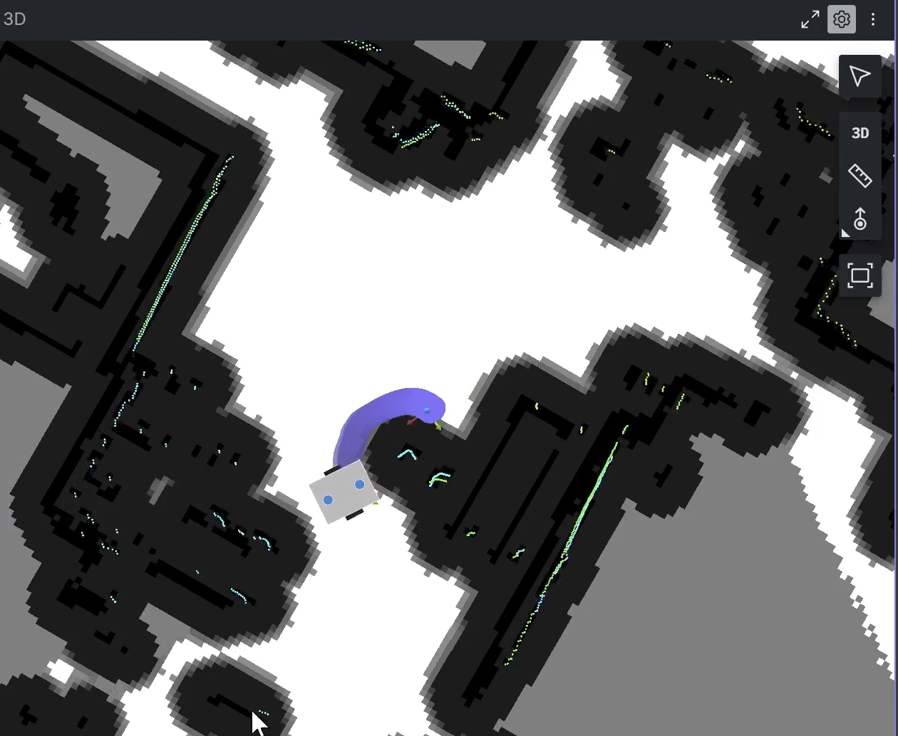
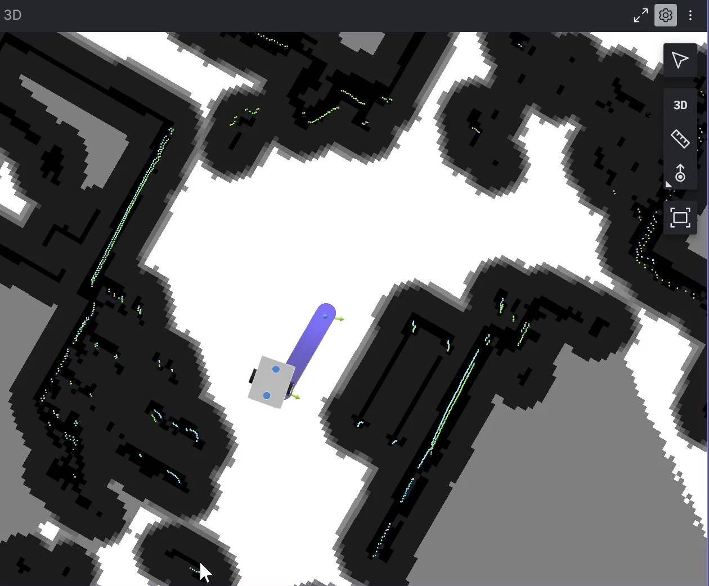
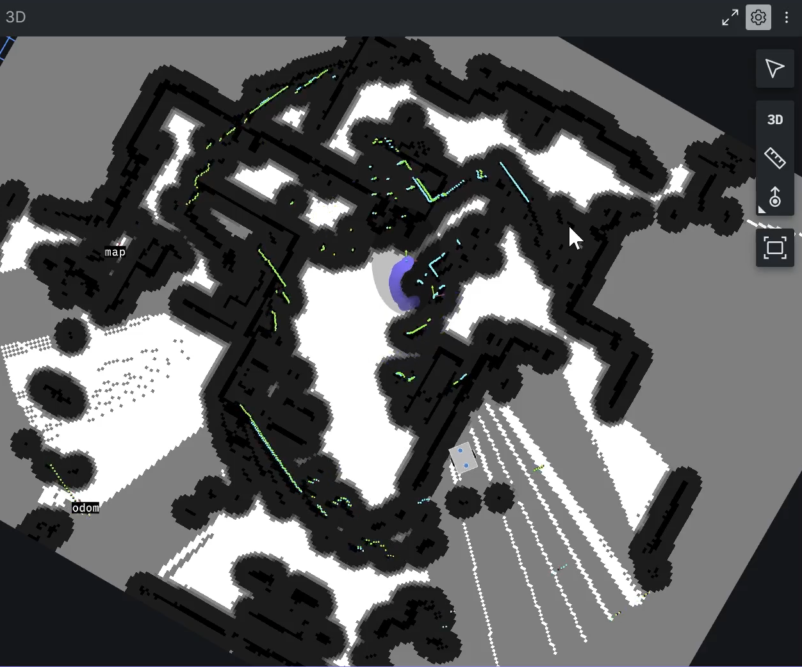

# Nav2 Navigation Test

## 1. 시험 목적

CUBIC C1의 ROS 2 Nav2 기반 자율주행 기능이 다음 상황에서 어떻게 동작하는지 확인하였다.

- 정상적인 목표점 경로 생성
- 주행 경로에 장애물이 진입했을 때의 경로 재계획
- 장애물이 제거된 이후의 경로 복원
- 로봇 위치를 의도적으로 교란한 상태에서의 충돌 회피 동작

본 시험은 실제 주행 환경에서 Nav2의 경로 계획 및 장애물 대응 특성을 확인하는 것을 목적으로 수행하였다.

---

## 2. 시험 환경

- Navigation Framework: ROS 2 Nav2
- Localization: AMCL
- Global / Local Costmap 기반 장애물 인식
- LiDAR 기반 주변 환경 인식
- 사전에 생성한 2D Occupancy Grid Map 사용

시험 중 Foxglove 3D 화면을 통해 지도, 로봇 위치, 경로 및 장애물 정보를 확인하였다.

---

## 3. 시험 1 — 장애물 진입에 따른 경로 재계획

초기 상태에서는 로봇과 목표점 사이에 직선 경로가 생성되어 있었다.

이후 사용자가 해당 경로 중간에 직접 진입하여 기존 경로를 차단하였다.

Nav2는 기존 직선 경로를 유지하지 않고, 장애물을 피해 이동하기 위한 곡선 형태의 새로운 경로를 생성하였다.

**그림 1. 기존 직선 경로가 장애물 진입으로 인해 곡선 우회 경로로 변경된 상태**

### 결과

- 기존 경로에 장애물이 존재할 경우 경로를 다시 생성함
- 장애물을 통과하는 경로 대신 우회 가능한 경로를 선택함
- LiDAR 기반 장애물 정보가 Navigation 경로 계획에 반영됨을 확인함

---

## 4. 시험 2 — 장애물 제거 이후 경로 복원

이후 사용자가 기존 경로에서 빠져 장애물이 제거된 상태를 만들었다.

장애물이 제거되자 Nav2는 우회 경로를 계속 유지하지 않고, 목표점까지 보다 직접적으로 이동할 수 있는 직선 형태의 경로로 다시 변경하였다.

**그림 2. 장애물 제거 이후 곡선 우회 경로에서 직선 경로로 다시 변경된 상태**

### 결과

- 장애물이 제거된 이후 현재 환경을 다시 반영함
- 불필요한 우회 경로를 유지하지 않고 보다 직접적인 경로로 변경함
- 환경 변화에 따라 경로가 동적으로 갱신됨을 확인함

---

## 5. 시험 3 — Localization 교란 상황에서의 충돌 회피

Nav2가 정상적으로 동작하는 상태에서 로봇을 손으로 직접 이동시켜 실제 위치와 Localization 결과 사이에 의도적인 오차를 발생시켰다.

이후 새로운 목표점을 지정하여 Navigation을 수행하였다.

이 상태에서는 위치추정 오차로 인해 로봇이 최종 목적지까지 정상적으로 도달하지 못하였다.

그러나 주행 중 주변 벽이나 장애물에 충돌하지 않았으며, LiDAR 기반 Local Costmap 및 장애물 회피 기능은 계속 동작하는 것을 확인하였다.

**그림 3. 로봇 위치를 의도적으로 교란한 이후 Navigation을 수행한 상태**

### 결과

- 강제 위치 교란 이후 목표점 도달에는 실패함
- 위치추정 상태가 불안정한 상황에서도 주변 장애물과 충돌하지 않음
- Global Localization 오류와 별개로 Local obstacle detection 기능이 지속적으로 동작함을 확인함

---

## 6. 시험 결과 요약

| 시험 항목 | 조건 | 결과 |
|---|---|---|
| 장애물 진입 | 기존 직선 경로에 장애물 배치 | 곡선 우회 경로로 재계획 |
| 장애물 제거 | 경로 상 장애물 제거 | 직선 형태의 경로로 재계획 |
| Localization 교란 | 로봇을 수동으로 이동시켜 위치 오차 발생 | 목적지 도달 실패, 충돌 없이 주행 |

---

## 7. 결론

본 시험을 통해 CUBIC C1의 Nav2 Navigation 시스템이 주변 환경 변화에 따라 경로를 동적으로 재계획하는 것을 확인하였다.

특히 기존 경로에 장애물이 진입한 경우 우회 경로를 생성하였으며, 장애물이 제거된 이후에는 보다 직접적인 경로로 다시 변경되었다.

또한 로봇 위치를 의도적으로 교란한 비정상 조건에서는 최종 목표점 도달에는 실패하였으나, 주변 장애물과의 충돌은 발생하지 않았다.

이를 통해 CUBIC C1의 Navigation 시스템이 정상적인 목표점 주행뿐만 아니라 환경 변화 및 일부 위치추정 이상 상황에서도 장애물 정보를 지속적으로 반영하는 것을 확인하였다.

---

## 8. 시험의 한계

Localization이 크게 교란된 상태에서는 최종 목표점까지 정상적으로 도달하지 못하였다.

따라서 본 시험은 강한 위치추정 오류 상황에서도 Navigation이 정상적으로 복구된다는 것을 의미하지 않으며, 해당 상황에서 LiDAR 기반 장애물 회피 기능이 유지되는 것을 확인한 시험이다.

향후에는 위치추정 재초기화 또는 Localization recovery 절차를 추가하여 위치 오차 발생 이후 자동 복구 가능성을 검증할 필요가 있다.