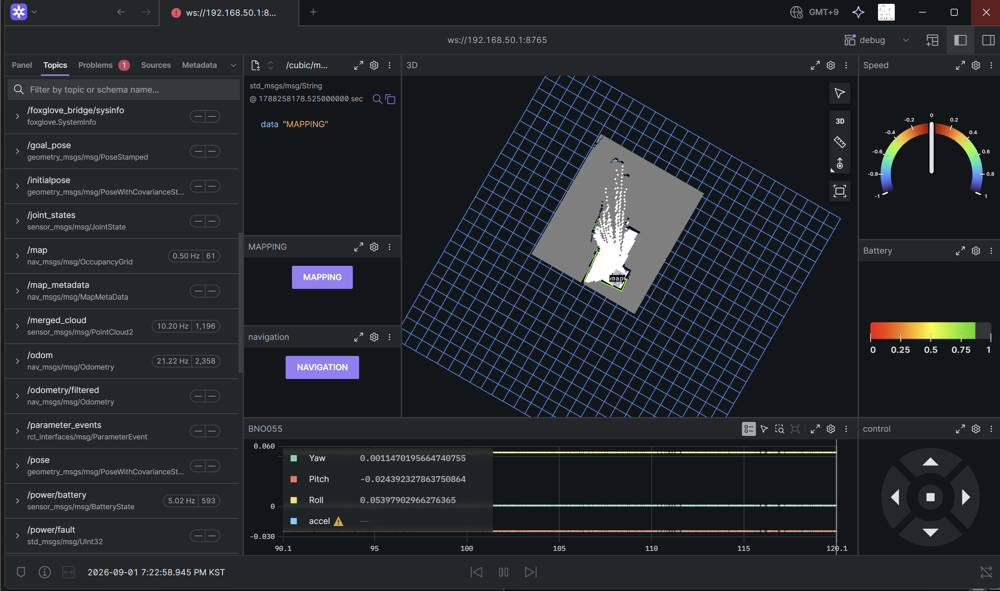

# System Integration & External Interface Test

CUBIC C1은 로봇 하위 하드웨어를 개별적으로 동작시키는 것뿐만 아니라,
전원 인가 이후 SBC, MCU, 센서, ROS 2 Node 및 외부 사용자 인터페이스가
하나의 시스템으로 동작하도록 구성하였다.

본 시험에서는 다음 항목을 확인하였다.

1. 전원 인가 이후 시스템 Bring-up
2. ROS 2 Topic 및 Sensor 상태 확인
3. Foxglove 기반 상태 Monitoring
4. External Ethernet Interface
5. External Power Interface

---

# 1. System Bring-up Test

## 1.1 시험 과정

CUBIC C1의 전원 Key를 이용하여 시스템을 부팅하였다.

일반적인 부팅 과정은 다음과 같다.

```text
Main Power ON
      │
      ▼
SBC / Controller Boot
      │
      ▼
PCU Boot Buzzer
      │
      ▼
LiDAR Start
      │
      ▼
ROS 2 Nodes / Topics Start
      │
      ▼
Foxglove Monitoring
````

전원 인가 이후 PCU의 Buzzer 알림과 LiDAR 작동을 통해
하위 하드웨어의 초기화를 확인할 수 있었으며,
ROS 2 Node가 구동되면 각 센서 및 제어 Topic이 Monitoring 화면에 표시되었다.

---

## 1.2 반복 운용 결과

본 시험은 별도의 일회성 Test Sequence가 아니라
CUBIC의 SLAM, Navigation 및 모터 제어 시험을 수행할 때마다
전원 투입 과정에서 반복적으로 수행되었다.

각 개발 및 주행 시험 과정에서

* Controller 부팅
* LiDAR 구동
* ROS 2 Topic 생성
* Foxglove 연결 및 상태 표시

를 반복적으로 확인하였다.

다만 개별 부팅에 필요한 시간을 정량적으로 기록하지 않았으므로
Boot Time에 대한 수치 평가는 수행하지 않는다.

---

# 2. ROS 2 Topic Integration

CUBIC에 연결된 하위제어기와 센서는 ROS 2 Topic을 통해
상위 시스템에서 상태를 확인할 수 있도록 구성하였다.

실제 운용 상태에서 Foxglove를 통해
각 Topic과 센서 데이터가 활성화되는 것을 확인하였다.



**Fig. 1. CUBIC C1 정상 운용 상태에서 확인한 ROS 2 Topic 및 시스템 상태**

이를 통해 각각 독립적으로 연결된 하드웨어가
ROS 2 Middleware 상에서 하나의 로봇 시스템으로 통합되어 있음을 확인하였다.

---

# 3. Foxglove Monitoring

CUBIC은 외부 개발자가 로봇의 상태를 확인할 수 있도록
Foxglove 기반 Monitoring 환경을 사용하였다.

Foxglove를 통해 다음과 같은 시스템 정보를 확인하였다.

* LiDAR Scan
* Robot TF
* Odometry
* Navigation 상태
* 주요 ROS 2 Topic
* Sensor 및 Controller 동작 상태

이를 통해 로봇 케이스를 분해하거나
각 MCU에 별도의 Serial Debugger를 연결하지 않고도
상위 시스템에서 로봇 전체의 상태를 확인할 수 있도록 구성하였다.

---

# 4. External Ethernet Interface Test

## 4.1 시험 목적

CUBIC 상단의 RJ45 Port를 통해
외부 연구용 컴퓨터 또는 상단 Module이
로봇의 SBC와 유선 Network로 통신할 수 있는지 확인하였다.

---

## 4.2 구성

Raspberry Pi의 Ethernet Interface를 외부 RJ45 Port로 연결하고,
고정 IP 기반의 직접 Network 연결이 가능하도록 설정하였다.

노트북을 해당 RJ45 Port에 직접 연결하여 통신을 시험하였다.

---

## 4.3 결과

외부 노트북에서 CUBIC의 Raspberry Pi에 접근하여 다음 기능을 확인하였다.

* 고정 IP를 통한 Network 연결
* SSH 접속
* Raspberry Pi 내부 File 접근
* Remote command 실행

따라서 별도의 Wi-Fi AP가 없는 상황에서도
상단 RJ45 Port를 이용하여 외부 장치와 유선 통신할 수 있음을 확인하였다.

> 본 인터페이스는 DDS 전용 Port로 한정하지 않고,
> 표준 Ethernet Interface로 구성하여 사용자가 필요에 따라
> SSH, ROS 2 또는 기타 Ethernet 기반 통신을 사용할 수 있도록 하였다.

---

# 5. External Power Interface Test

## 5.1 시험 목적

상단 Module에 전원을 공급하기 위한 XT60 Port가
실제 Battery Power와 정상적으로 연결되어 있는지 확인하였다.

---

## 5.2 시험 방법

Multimeter를 이용하여 상단 XT60 Port의 출력 전압을 측정하였다.

---

## 5.3 결과

XT60 Port에서 로봇 Battery Voltage가 출력되는 것을 확인하였다.

이를 통해 외부 Module 또는 추가 전장장치가
별도의 배터리를 추가하지 않고 CUBIC의 전원계통을 사용할 수 있음을 확인하였다.

본 시험에서는 Port의 최대 부하전류를 측정하는 Load Test를 수행하지 않았으며,
전압 출력 및 전기적 연결 여부를 확인하는 범위에서 시험하였다.

---

# 6. Module Interface

최종적으로 CUBIC의 상부 Module Interface는 다음 두 연결을 제공한다.

```text
External Module
      │
      ├── RJ45
      │     └─ Ethernet / SSH / ROS 2 / User Network
      │
      └── XT60
            └─ Battery Power
```

이를 통해 외부 Module을 추가할 때
로봇 내부의 SBC 또는 Battery Wiring을 직접 수정하지 않고도
외부에서 통신과 전원을 연결할 수 있도록 구성하였다.

---

# 7. 시험 결과 요약

| 검증 항목             | 결과                                      |
| ----------------- | --------------------------------------- |
| System Boot       | 반복적인 실제 운용에서 Controller 및 Sensor 초기화 확인 |
| ROS 2 Integration | 주요 Topic 생성 및 Monitoring 확인             |
| Foxglove          | Robot/Sensor/Navigation 상태 확인           |
| RJ45 Ethernet     | Laptop 직접 연결 및 SSH 접속 성공                |
| File Access       | Ethernet을 통한 SBC File 접근 확인             |
| XT60 Power        | Multimeter로 Battery Voltage 출력 확인       |

---

# 8. 결론

CUBIC C1의 반복적인 실제 운용을 통해
전원 투입 이후 Controller, Sensor 및 ROS 2 Software가 정상적으로 구성되고
Foxglove에서 전체 시스템 상태를 확인할 수 있음을 확인하였다.

또한 상단 RJ45 Interface를 통해 외부 노트북에서
고정 IP 기반 SSH 및 File 접근이 가능하였으며,
XT60 Interface에서는 Battery Voltage가 정상적으로 출력되는 것을 확인하였다.

이를 통해 CUBIC의 상부 Module Interface가 단순한 기구적 장착부뿐만 아니라

* Mechanical Mounting
* Network Communication
* Power Supply

를 함께 제공하는 실제 외부 확장 Interface로 동작함을 확인하였다.