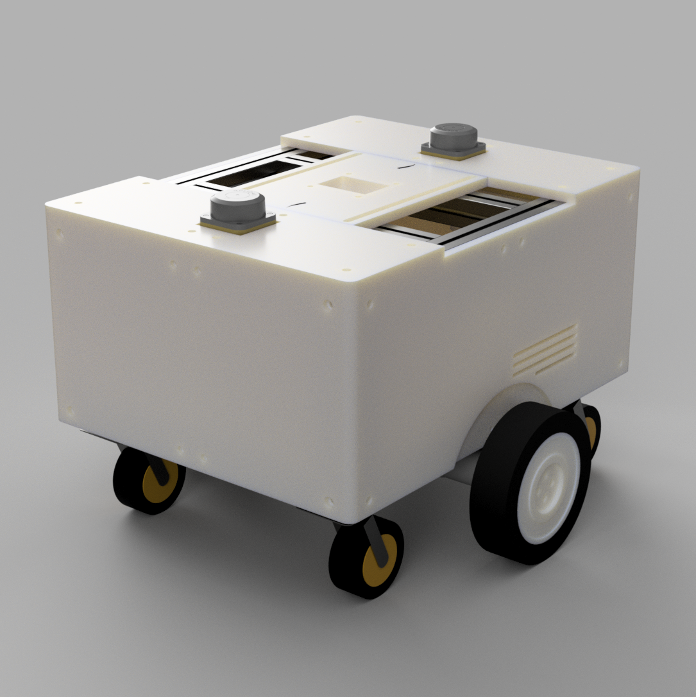

# CUBIC 3D Model

`06_3Dmodel`은 CUBIC C1의 **전체 조립 모델, 개별 설계 부품 및 렌더 이미지**를 포함한다.

기구 구조와 장착 방식에 대한 상세 설명은
[`Mechanical Integration`](../02_Architecture/01_Mechanical%20Integration/Mechanical%20Integration.md)을 참고한다.

---

## 📁 구성

```text
06_3Dmodel
├─ assemble
├─ part
└─ render
```

---

## 🧩 `assemble`

전체 조립 상태의 STEP 모델을 포함한다.

```text
assemble/cubic.step
```

CUBIC의 전체 크기, 부품 배치, 장착 위치를 확인하거나 새로운 상부 모듈을 설계할 때 기준 모델로 사용할 수 있다.

---

## 🔩 `part`

CUBIC 제작에 사용된 개별 설계 부품의 STEP 파일을 포함한다.

주요 구성은 다음과 같다.

* 외장 Plate
* LiDAR Holder
* Battery Hatch
* Sensor / Switch Bracket
* RJ45 / XT60 Holder
* Wheel Hub
* Tire
* PC817 Bracket

필요한 부품만 개별적으로 불러와 수정하거나 재제작할 수 있다.

---

## 🖼️ `render`

프로젝트 문서 및 README에서 사용하는 CUBIC C1 렌더 이미지를 포함한다.

```text
render/render.png
```



---

> 전체 기구 구조, 상단 모듈 장착 방식 및 외부 인터페이스에 대한 설명은
> [`Mechanical Integration`](../02_Architecture/01_Mechanical%20Integration/Mechanical%20Integration.md)을 참고한다.
